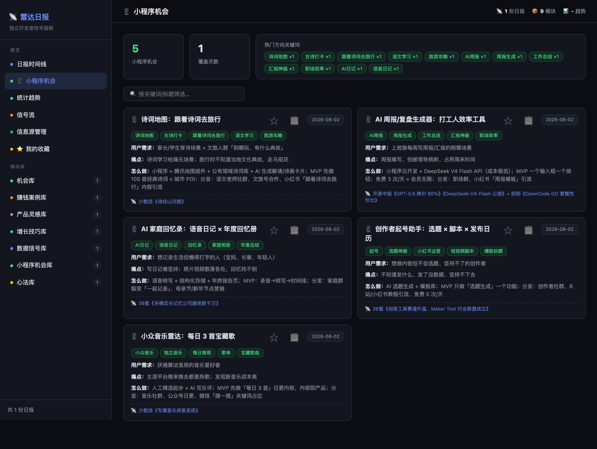

# 📡 雷达日报 Dashboard（分享版）



独立开发者的信号雷达——每天自动采集 **19 个国内外信息源**（App Store 新应用 / GitHub 热榜 / 即刻圈子 / 36氪 / 少数派 / 开源中国 / V2EX / Product Hunt / trustmrr…），生成可浏览的可视化面板，帮你发现产品机会。

> 🎁 已内置示例数据，安装完打开就能看到完整效果。
>
> 📱 **本分享版默认偏重「微信小程序机会」**——这是作者自己正在追踪的方向，日报会专门生成「小程序机会」模块，面板也有独立的「📱 小程序机会」专页。如果你关注的是**海外产品**或**其他 App 产品**方向，改起来很简单，见下方 [🧭 自定义方向](#-自定义方向)。

---

## ⚡ 快速开始（3 步）

```bash
# 1. 安装（创建环境 + 装依赖 + 生成配置）
bash install.sh

# 2. 启动
bash start.sh

# 3. 打开浏览器
# 访问 http://127.0.0.1:5080
```

### 🤖 不想手动装？让 AI 帮你

把下面这段话发给任意 AI 编程助手（Hermes / Cursor / Claude Code…），它会帮你完成全部安装：

> 帮我安装并启动这个开源项目：https://github.com/susumr/radar-dashboard
> 步骤：1) clone 到本地 2) 运行 install.sh 3) 运行 start.sh 4) 确认服务在 http://127.0.0.1:5080 能打开
> 我关注微信小程序机会方向，顺便读一下 README 告诉我怎么配置 .env（DeepSeek Key 等）。

如果你用的是 [Hermes Agent](https://hermes-agent.nousresearch.com)，还可以让它**全自动接管**：每天定时采集 → AI 生成日报 → 推送消息，详见文末「生成每日 AI 日报」方式 B。

## 📊 功能一览

| 页面 | 说明 |
|------|------|
| **日报时间线** | 每日 AI 精选日报（机会/赚钱案例/灵感/心法…） |
| **📱 小程序机会** | ⭐ 本版核心：聚合所有小程序选题，关键词筛选 |
| **📡 信号流** | tophub 式热榜：左侧 19 个平台，右侧紧凑榜单 |
| **🔌 信息源管理** | 各平台接入状态 |
| **⭐ 我的收藏** | 收藏单条信息 + 复制发给 AI 分析 |

## 🧭 自定义方向

本版**偏重小程序**：日报里「小程序机会」模块是最高优先级（每天 3-5 条），面板左侧也有「📱 小程序机会」专页。这套逻辑在 **AI 生成日报时的提示词**里定义，不在代码里——所以想改方向，改提示词就行。

### 方案 A：只改方向，不动代码（推荐）

「日报生成提示词」决定 AI 输出哪些模块、偏重什么。有两处会用到它，**任选一处改**：

| 你的场景 | 改哪里 |
|---------|--------|
| 手动用 ChatGPT/Claude/DeepSeek 生成日报 | 改本 README「生成每日 AI 日报」里给 AI 的那段话（把"小程序机会"换成你的方向） |
| 用 Hermes 自动生成（cron） | 改 `hermes-integration/hn-daily-radar-SKILL.md` 里 `Cron Prompt Template` 的「模块内容规则」 |

**想改成「海外产品方向」**：在提示词里把 `8️⃣ 微信小程序机会` 这一段删掉或改掉，把 `1️⃣ 今日机会` 的优先级提到最高，背景改成「出海 Web 应用独立开发者，关注全球市场」——采集脚本本身已经包含 trustmrr / IndieHackers / Product Hunt / Reddit 等海外源，信号天然够用。面板上看「📌 机会库」「💰 赚钱案例库」「💡 产品灵感库」即可（左侧「模块库」分组）。

**想改成「App 产品方向」**：把提示词里的映射逻辑从「→ 小程序落地」改成「→ iOS/Android App 落地」。采集脚本已经接了 App Store 中/台/美/日/韩 5 个区的上新源，天然是 App 方向信号。

### 方案 B：增删数据源

| 做什么 | 改哪里 |
|-------|--------|
| 加/删采集源 | `scripts/daily_signals.py`（采集逻辑）+ `app.py` 的 `SOURCE_META`（面板信息源管理页显示） |
| 调整页面模块 | `templates/index.html`（前端，单文件） |

采集源目前：App Store 中国/台湾/美国/日本/韩国、GitHub 总榜/JS榜/中文榜、即刻 AI探索站/AI讨论组/工程师、36氪、少数派、开源中国、V2EX、trustmrr、IndieHackers、Reddit、Product Hunt，共 19 源。

### 想恢复原版（不偏重小程序）？

把提示词里「8️⃣ 微信小程序机会（最高优先级）」段落删除即可，其余模块（机会/案例/灵感/增长/工具/踩坑/数据信号/心法）本来就是中性的。

## 🤖 给 AI Agent（Hermes / Cursor / Claude Code…）的阅读指南

这个仓库是一个**「采集 → 生成 → 展示」三段式数据管道**，Agent 接手时按这个顺序读：

1. **数据从哪来**：`scripts/daily_signals.py` 每天并行抓取 19 个源，原始信号存 `data/raw_signals/YYYY-MM-DD.json`（按平台分组，含 url）
2. **日报怎么生成**：把采集到的信号交给 LLM，按**日报 JSON 格式**整理成 `data/reports/YYYY-MM-DD.json`。核心结构：
   ```json
   { "date": "2026-08-02", "sources": {"v2ex": 4, ...},
     "modules": { "opportunities": [...], "moneyCases": [...], "miniProgram": [...], "dailyWisdom": {...} } }
   ```
   「小程序机会」就是 `modules.miniProgram` 这个数组——面板专页直接读它，跨日期自动聚合。
3. **怎么展示**：`app.py`（Flask 后端，只读 JSON 出 REST API）+ `templates/index.html`（单文件前端，hash 路由 `#/miniapp` 等）。后端无数据库，纯文件即数据，改 JSON 就能看到效果。
4. **要自动化的 Agent**：读 `hermes-integration/HERMES-INTEGRATION.md`（配置 Hermes 全自动采集+生成+推送的完整步骤），skill 定义在 `hermes-integration/hn-daily-radar-SKILL.md`（含日报模板、cron prompt、JSON schema、故障排查）。

**Agent 要做的日常操作**：加数据源（改 daily_signals.py + SOURCE_META）、改日报风格（改 skill 里的 prompt 模板）、修展示（改 index.html）、跑采集（`python3 scripts/daily_signals.py`）。

## 🔄 每日数据采集

```bash
# 手动采集一次（约 20 秒，抓取 19 个平台最新信号）
python3 scripts/daily_signals.py

# 自动采集：加到系统定时任务（每天 08:45）
crontab -e
# 添加一行：
45 8 * * * cd /你的路径/radar-dashboard && /你的路径/radar-dashboard/venv/bin/python scripts/daily_signals.py >> data/collect.log 2>&1
```

采集后：
- 原始信号 → `data/raw_signals/` → 「信号流」页可见
- 每日 AI 日报 → 手动生成（见下）→ 「日报时间线」页可见

## 🤖 生成每日 AI 日报（可选）

「日报时间线」的日报需要 AI 生成。有两种方式：

### 方式 A：用任意 AI 工具（免费，无需额外配置）

1. 先跑采集：`python3 scripts/daily_signals.py`
2. 把终端输出的信号列表**复制**给任何 AI（ChatGPT/Claude/DeepSeek）
3. 让 AI 按下面的格式整理成日报 JSON（**想改方向？把这里的话也改掉，见「自定义方向」**）：
   > 你是独立开发者的信号雷达。从上面信号里精选最有价值的 3-5 条，输出：1️⃣ 今日机会 2️⃣ 赚钱案例 3️⃣ 产品灵感 4️⃣ 增长技巧 5️⃣ 工具 6️⃣ 踩坑 7️⃣ 数据信号 8️⃣ **微信小程序机会（最高优先级，3-5 条：把当天信号映射成国内微信小程序能落地的选题，含标题/启发/建议/关键词/用户需求/痛点/做法/关联信号）** 🎯 今日心法。
4. 把 AI 返回的 JSON 保存为 `data/reports/2026-08-02.json`（JSON 格式见上「Agent 阅读指南」，或直接让 AI 按这个结构输出）

### 方式 B：接入 Hermes Agent（完整自动化）

雷达日报原生跑在 [Hermes Agent](https://hermes-agent.nousresearch.com) 上，配置 cron 后每天 08:45 自动采集 → AI 生成日报 → 推送到 Telegram。

**如果朋友有 Hermes**：把 `hermes-integration/HERMES-INTEGRATION.md` 发给 Hermes 对话，让它自动配置（采集脚本注册 + skill 导入 + cron 创建）。详见该文件。

**从 GitHub 拿到的用户**：仓库在 https://github.com/susumr/radar-dashboard，下载解压后即可开始。

## 🔧 配置说明（.env）

全部可选，不填也能跑。**详细的申请步骤见 [`CONFIG-GUIDE.md`](CONFIG-GUIDE.md)（手把手教学）**。

| Key | 作用 | 获取 | 优先级 |
|-----|------|------|--------|
| `DEEPSEEK_API_KEY` | 英文信号自动翻译中文 | https://platform.deepseek.com/ | ⭐ 推荐 |
| `TRUSTMRR_API_KEY` | 已验证收入创业公司数据 | https://trustmrr.com/ | 🟢 可选 |
| `PH_TOKEN` | Product Hunt 每日新品 | https://www.producthunt.com/v2/oauth/applications | 🟢 可选 |
| `REDDIT_*` | Reddit 信号（IP 被封时需 OAuth） | https://www.reddit.com/prefs/apps | 🟡 可选 |

## 🗂️ 目录结构

```
radar-dashboard/
├── app.py                  # Web 后端（REST API，只读 JSON）
├── templates/index.html    # 前端页面（单文件，hash 路由）
├── scripts/
│   ├── daily_signals.py    # 数据采集脚本（19 源）
│   └── screenshot.py       # 生成 README 截图（Playwright）
├── docs/screenshot-miniapp.png  # README 截图（小程序机会页）
├── data/
│   ├── reports/            # 日报 JSON
│   ├── raw_signals/        # 原始信号 JSON
│   └── favorites.json      # 你的收藏
├── hermes-integration/     # Hermes 自动化配置（HERMES-INTEGRATION.md + skill）
├── requirements.txt
├── install.sh              # 一键安装
├── start.sh                # 启动
└── .env                    # 配置（可选）
```

## ❓ 常见问题

**打开后只有示例数据？**
内置的 `2026-08-02.json`（日报 + 原始信号）是示例数据，安装完就能看效果。你采集/生成的数据会自动追加，按日期区分。

**示例数据会被覆盖吗？**
如果你某天也采集/生成了 2026-08-02 的日报，会覆盖示例（正常，说明你开始有自己的数据了）。

**没有 DeepSeek Key 会怎样？**
App Store 美国/日本/韩国、GitHub、Product Hunt 等英文内容不翻译，显示原文。其他功能正常。

**数据存在哪？**
全部在本机 `data/` 目录，纯 JSON 文本，方便备份迁移。

**想换端口？**
`start.sh` 里把 5080 改成你想要的端口。

**想重新生成 README 截图？**
```bash
# 需要先启动服务（bash start.sh），并装好 playwright：
venv/bin/pip install playwright
venv/bin/python scripts/screenshot.py docs/screenshot-miniapp.png
```
